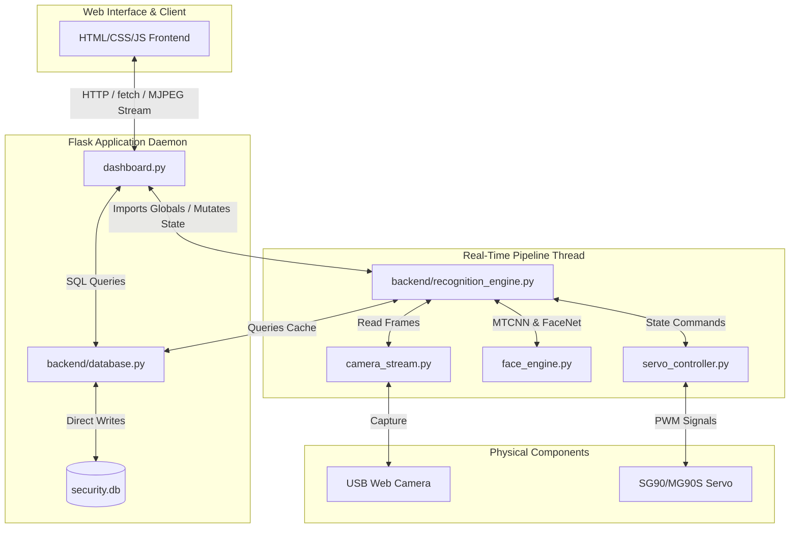
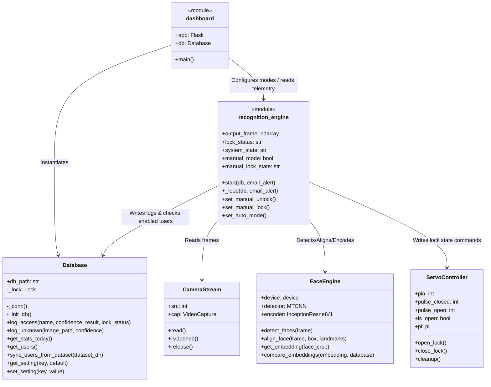
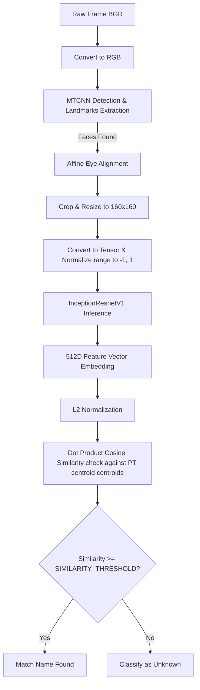
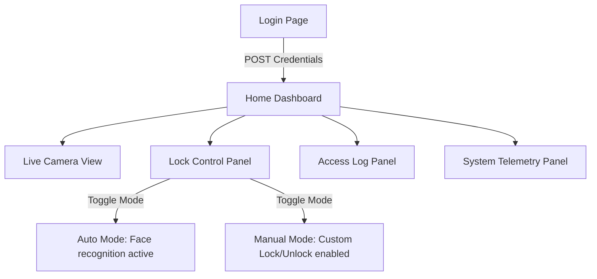
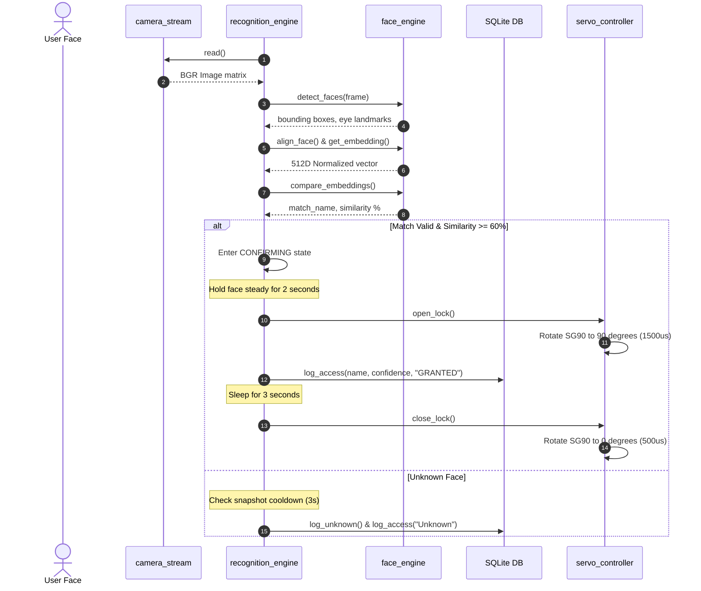
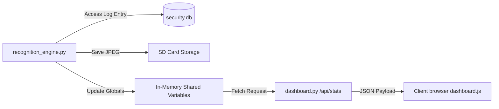

# Face Value Edge Security System: Technical Specification & Engineering Report

This document outlines the exact implementation details, software architecture, folder structure, database schema, API routing, and hardware configuration for the **Face Value (Phase 3)** edge-based facial access control system.

---

## 1. Overall System Architecture

The **Face Value** system is a hybrid edge security application designed to run locally on a Raspberry Pi. It integrates a real-time computer vision pipeline with a Flask web application, an SQLite local database, and a hardware servo motor controller.



---

## 2. Complete Folder and File Structure

Below is the directory layout of the target project workspace:

```text
C:\Users\thush\.gemini\antigravity\scratch\face_access_control\
├── backend\
│   ├── __init__.py           # Package initializer
│   ├── database.py           # Thread-safe SQLite database manager
│   ├── email_alert.py        # SMTP email alerts sender (not detailed above, handles notifications)
│   └── recognition_engine.py # Core face recognition state machine loop and globals
├── embeddings\
│   └── authorized_faces.pt   # PyTorch serialized dictionary of face embedding centroids
├── frontend\
│   ├── static\
│   │   ├── css\
│   │   │   └── style.css     # Premium dark theme stylesheet (Glassmorphism & animations)
│   │   └── js\
│   │       └── dashboard.js  # Global telemetry polling, charts, and toast actions
│   └── templates\
│       ├── base.html         # Navbar layout and global CDNs (Plus Jakarta Sans, FontAwesome)
│       ├── camera.html       # Video stream and DB retraining interface
│       ├── control.html      # Manual override state console (segmented controls)
│       ├── dashboard.html    # Home page with quick security actions card
│       ├── login.html        # Admin session gatekeeper
│       ├── logs.html         # paginated logs viewer
│       ├── settings.html     # DB settings editor
│       ├── system.html       # CPU/RAM/Disk metrics panel
│       ├── unknown.html      # Captured unknown face grids
│       ├── user_detail.html  # Dedicated user dataset gallery
│       └── users.html        # Authorized user list and deletion commands
├── logs\                     # Dynamic data directory
│   ├── access_log.csv        # Legacy access log
│   └── unknown_faces\        # Snapshot storage grouped by date folders (YYYY-MM-DD/unknown_HH-MM-SS.jpg)
├── dataset\                  # Raw target enrollment images sorted by username subdirectories
├── camera_stream.py          # OpenCV VideoCapture wrapper (Threaded execution ready)
├── capture.py                # Frame extraction tool for user enrollment
├── config.py                 # Central configuration parameters
├── dashboard.py              # Main Flask application entry point
├── enroll.py                 # Offline centroid builder script
├── face_engine.py            # MTCNN detector and FaceNet encoder wrapper
├── recognize.py              # Legacy standalone entry point
├── requirements.txt          # Python package requirements
├── security.db               # Live SQLite WAL database file
└── servo_controller.py       # GPIO hardware/simulation driver using pigpio
```

---

## 3. Complete Execution Flow

1. **Power-On & Boot:** The Raspberry Pi powers on. If configured via systemd, the `pigpiod` daemon starts automatically, followed by the launch of `dashboard.py`.
2. **Database Initialization:** `dashboard.py` instantiates the `Database` class. If `security.db` does not exist, the SQLite layer creates the file and executes the creation schema scripts.
3. **Hardware Check:** `ServoController` initializes, connecting to `pigpiod` on the configured `SERVO_GPIO_PIN` (GPIO 18) and sets the servo to the locked position (`SERVO_CLOSED_ANGLE` at `0°`, pulse width `500µs`).
4. **Engine Start:** `dashboard.py` starts the recognition loop inside `recognition_engine.py` as a separate background daemon thread. The engine loads the PyTorch embedding database from `embeddings/authorized_faces.pt`.
5. **Web App Launch:** The Flask web server binds to `0.0.0.0:5000` (allowing local network access) and waits for incoming connections.
6. **Authentication Gate:** Users navigating to the dashboard are redirected to `/login` to authenticate against secure database credentials.
7. **Dashboard Telemetry Polling:** Once authenticated, the browser fetches the page layout. Scripts invoke `/api/stats` and `/api/timeline` every 2–3 seconds to dynamically update the UI state.

---

## 4. Flask Web Server Launch Sequence

> [!NOTE]
> The codebase uses a **Flask** web server, not a FastAPI server. All routing, endpoints, and session management are built with Flask inside [dashboard.py](file:///C:/Users/thush/.gemini/antigravity/scratch/face_access_control/dashboard.py). There is no FastAPI present in this project. The following documentation represents the exact Flask implementation.

When `python dashboard.py` is executed:
1. **Modules Import:** Python loads Flask, Werkzeug, standard modules (`threading`, `time`), and local project files (`config`, `backend.database`, `backend.recognition_engine`, `backend.email_alert`).
2. **Database Connection:** An instance of `Database(config.DB_SQLITE_PATH)` is created.
3. **Settings Synchronization:** `_apply_db_settings()` is called. It retrieves all rows from the `settings` database table and overrides matching variables inside the `config` module in-memory.
4. **Daemon Thread Spawn:** `recognition_engine.start(db, email_alert)` is executed. This initiates the `ServoController` and spawns a daemon thread (`_loop`), passing references of the active database instance.
5. **App Run:** Flask executes `app.run(host='0.0.0.0', port=config.DASHBOARD_PORT)`.

---

## 5. Python Modules, Classes, and Interactions



---

## 6. Camera Initialization and Frame Capture

The camera pipeline is handled by `CameraStream` in [camera_stream.py](file:///C:/Users/thush/.gemini/antigravity/scratch/face_access_control/camera_stream.py):
* **Backend:** It attempts to initialize `cv2.VideoCapture(src, cv2.CAP_V4L2)` specifically for Linux-based systems to enable high-performance frame capture. If this fails (e.g. running locally on a Windows development system), it automatically falls back to `cv2.VideoCapture(src)`.
* **Configuration:** The resolution is set using `self.cap.set(cv2.CAP_PROP_FRAME_WIDTH, config.CAMERA_RES[0])` (640px) and `self.cap.set(cv2.CAP_PROP_FRAME_HEIGHT, config.CAMERA_RES[1])` (480px).
* **FPS:** The camera capture rate is configured to `config.CAMERA_FPS` (30 FPS).
* **Polling:** The background thread periodically calls `cap.read()`, which yields a boolean status flag `ret` and the captured image matrix `frame` (BGR layout).

---

## 7. Face Detection and Face Recognition Pipeline



### Core Architecture Specifications:
* **Models:** MTCNN (Multi-task Cascaded Convolutional Networks) for detection and facial landmark coordinate output. FaceNet (InceptionResnetV1 pretrained on `vggface2` dataset) for face embedding generation.
* **Loading & Device:** Both models run locally on the CPU (`torch.device("cpu")`). Weights are loaded from PyTorch's cache folders after the initial download (initiated via `pretrained='vggface2'`).
* **Preprocessing:**
  1. Frames are converted from OpenCV BGR to RGB format.
  2. Bounding boxes and eye landmarks are extracted.
  3. Eye alignment angle is computed: $\theta = \arctan2(dy, dx)$ between the left and right eyes.
  4. An affine rotation matrix is computed at the center coordinate between both eyes.
  5. The frame is rotated, cropped using the bounding box, and resized to $160 \times 160$ pixels.
* **Normalization:** Tensor pixel values are converted to floats and scaled: $T_{\text{norm}} = \frac{T - 127.5}{128.0}$.
* **Embedding Comparison:** Similarity calculations are executed using a dot product calculation since both vectors are L2-normalized:
  $$\text{Cosine Similarity} = \vec{A} \cdot \vec{B}$$
* **Thresholds & Decision Making:**
  * Minimum similarity threshold: `config.SIMILARITY_THRESHOLD = 0.60` ($60\%$).
  * The match is determined by the highest similarity centroid in the PyTorch database.
  * In **AUTO** mode: A match must be maintained continuously for `config.RECOGNITION_CONFIRM_TIME` (2.0s) before state transition to `UNLOCKED` is triggered.

---

## 8. Authorized Users Storage and Registration

* **Image Datasets:** Enrolled images are saved in `dataset/<username>/` (e.g. `dataset/john_doe/img_1.jpg`).
* **Embedding Compilation (`enroll.py`):**
  1. The dataset folder is scanned. For each user subdirectory, every image is loaded.
  2. The face is detected, aligned, and encoded into a 512D vector.
  3. All vectors for a single user are stacked: shape $(N, 512)$.
  4. A centroid vector is computed by taking the mean across the embedding stacks: `torch.mean(embeddings, dim=0)`.
  5. The mean vector is L2-normalized and stored in a dictionary mapping `username -> centroid`.
  6. The dictionary is saved to the SD card at `embeddings/authorized_faces.pt`.
* **Registration Flow:** Users are registered offline using `capture.py` or by adding folders to `dataset/` and calling the `/api/retrain` endpoint to run retraining in the background.

---

## 9. Unknown Face Handling

1. **Detection:** When `FaceEngine` classifies a face as "Unknown" while in the `LOCKED` state, it starts a snapshot flow.
2. **Cooldown:** Snapshots are throttled using `config.UNKNOWN_COOLDOWN` (3.0s) to prevent overloading system storage.
3. **Saving Snapshot:** The raw camera frame is captured using `cv2.imwrite` and saved to `logs/unknown_faces/YYYY-MM-DD/unknown_HH-MM-SS.jpg`.
4. **Database Log:** A row is inserted into the `unknown_faces` database table containing the timestamp, similarity confidence score, and file path.
5. **Dashboard Feed:** The `/unknown` page queries this table, serving images from `/media/unknown/<path>` and rendering the captured snapshots on the admin panel grid.

---

## 10. Database Schema Specification

The SQLite database file is stored at `/path/to/face_access_control/security.db` on the SD card. Write Ahead Logging (`PRAGMA journal_mode=WAL`) is enabled to allow simultaneous reads during background operations.

```mermaid
erDiagram
    users {
        INTEGER id PK
        TEXT name UNIQUE
        INTEGER image_count
        TEXT created_at
        INTEGER enabled
    }

    access_logs {
        INTEGER id PK
        TEXT timestamp
        TEXT person_name
        REAL confidence
        TEXT result
        TEXT lock_status
    }

    unknown_faces {
        INTEGER id PK
        TEXT timestamp
        REAL confidence
        TEXT image_path
    }

    settings {
        TEXT key PK
        TEXT value
    }
```

---

## 11. SD Card Storage Map

All files are stored relative to the project directory:

| Data Type | Absolute/Relative Path on RPi | Storage Format |
| :--- | :--- | :--- |
| **Authorized Face Images** | `dataset/<username>/` | JPG/PNG |
| **Face Embeddings** | `embeddings/authorized_faces.pt` | PyTorch serialized dictionary tensor file |
| **Unknown Snapshots** | `logs/unknown_faces/YYYY-MM-DD/` | JPG files |
| **Detection Logs** | `logs/access_log.csv` & `security.db` | SQLite Database / CSV lines |
| **Database** | `security.db` | SQLite 3 WAL database |
| **Configuration Files** | `config.py` | Python module definitions |
| **AI Model Files** | Locally cached under `~/.cache/torch/hub/checkpoints/` | PyTorch model weights |
| **Static Assets** | `frontend/static/` | CSS / JS files |
| **Templates** | `frontend/templates/` | Jinja2 HTML templates |

---

## 12. Flask Web Server API Reference

| Endpoint | Method | Parameters | Function Calls & Logic | Return Format |
| :--- | :--- | :--- | :--- | :--- |
| `/login` | `GET/POST` | `username`, `password` | Matches inputs with `admin`/`settings` table entries; establishes cookie-based session. | HTML render / Redirect |
| `/logout` | `GET` | None | Clears the session. | Redirect to `/login` |
| `/api/manual/unlock` | `POST` | None | Invokes `recognition_engine.set_manual_unlock()`. | `{"ok": true, "mode": "manual", "state": "OPEN"}` |
| `/api/manual/lock` | `POST` | None | Invokes `recognition_engine.set_manual_lock()`. | `{"ok": true, "mode": "manual", "state": "CLOSED"}` |
| `/api/manual/auto` | `POST` | None | Invokes `recognition_engine.set_auto_mode()`. | `{"ok": true, "mode": "auto"}` |
| `/api/stats` | `GET` | None | Returns active recognition engine globals (`fps`, `lock_status`, `system_state`, metrics). | JSON statistics payload |
| `/api/timeline` | `GET` | None | Queries `access_logs` and `unknown_faces` to compile the last 20 access entries. | JSON array |
| `/api/chart/hourly` | `GET` | None | Queries database to extract counts grouped by hour. | JSON array |
| `/api/chart/weekly` | `GET` | None | Queries database to extract counts grouped by weekday. | JSON array |
| `/api/retrain` | `POST` | None | Spawns a background worker executing `enroll.py`. | `{"ok": true, "message": "Retraining..."}` |
| `/api/retrain_status`| `GET` | None | Checks the status of the retrain worker thread. | `{"running": bool, "success": bool}` |
| `/api/export_csv` | `GET` | None | Reads SQLite log records and writes a CSV file to system temp folders. | File attachment stream |

---

## 13. Frontend-Backend Communication

The system communicates asynchronously to maintain performance and avoid locking the main UI:
1. **Asynchronous Polling:** Built-in JS scripts in `dashboard.js` and pages use standard `fetch()` API calls to poll `/api/stats` (every 2.0s) and `/api/timeline` (every 3.0s).
2. **Video Streaming:** The `` element makes a standard GET request to the Flask server. The server responds with a continuous multipart MJPEG stream using boundary headers:
   `multipart/x-mixed-replace; boundary=frame`
3. **Control Actions:** Setting the access mode or commanding the servo issues POST requests to `/api/manual/...` endpoints. The response is handled inside promises to trigger toast notifications in the UI without refreshing the page.

---

## 14. Frontend Architecture and UI Flow

The client interface is structured around a single-page styling layout inherited from `base.html`:
* **HTML/Jinja2:** Handles server-side layouts, routing highlights, flash alerts, and admin username rendering.
* **Modern CSS System:** Uses customized properties (`style.css`) to display frosted glass modules, cyber HUD elements, animated pulsing state dots, and high-contrast control configurations.
* **UI Flow:**


---

## 15. Live Camera Stream Implementation

The live stream uses a generator loop to feed frames directly to HTTP clients:
```python
def gen_frames():
    while True:
        with recognition_engine.frame_lock:
            frame = recognition_engine.output_frame
            if frame is None:
                continue
            ret, buffer = cv2.imencode('.jpg', frame)
            frame_bytes = buffer.tobytes()
        yield (b'--frame\r\n'
               b'Content-Type: image/jpeg\r\n\r\n' + frame_bytes + b'\r\n')
```
* **Synchronization:** A mutex thread lock (`recognition_engine.frame_lock`) is used to serialize access to the global `output_frame` variable, ensuring the Flask worker thread does not access the image matrix while the recognition engine is updating it.

---

## 16. Manual Override Internals

When a manual override command is executed:
1. An administrator clicks the **MANUAL** toggle or either of the **LOCK** / **UNLOCK** actions.
2. The browser sends a POST request to `/api/manual/unlock` or `/api/manual/lock`.
3. In `recognition_engine.py`, the state flags are modified:
   * `manual_mode` is set to `True`.
   * `manual_lock_state` is set to `"OPEN"` or `"CLOSED"`.
4. In the background recognition thread, the automatic FSM check is bypassed:
   ```python
   if manual_mode:
       if manual_lock_state == "OPEN":
           lock_status = "OPEN"
           _servo.open_lock()
       else:
           lock_status = "CLOSED"
           _servo.close_lock()
   ```
5. This halts autonomous door triggers while keeping face detection, visitor logging, snapshot captures, and email alerts fully active.

---

## 17. Servo Motor Hardware Control

The project uses an SG90/MG90S micro-servo motor controlled via hardware-based PWM signals.
* **Control Library:** Uses the `pigpio` Python library. It communicates with the system `pigpiod` daemon, using DMA (Direct Memory Access) channels to generate hardware-timed PWM signals. This avoids CPU jitter issues caused by standard software libraries like `RPi.GPIO`.
* **Hardware Configurations:**
  * GPIO Output Pin: `18` (hardware PWM pin).
  * Locked position: `SERVO_CLOSED_ANGLE = 0` ($0^\circ$), sending a `500µs` pulse width.
  * Unlocked position: `SERVO_OPEN_ANGLE = 90` ($90^\circ$), sending a `1500µs` pulse width.
* **Safety Handling:**
  * An internal state guard (`self.is_open`) tracks the current physical state of the lock. This prevents duplicate commands from sending redundant pulses to the servo.
  * Emergency cleanup: On application shutdown, the `cleanup()` method overrides state guards, rotates the servo back to $0^\circ$ (closed), sleeps for `0.5s` to allow the servo to physically close, and then sends `0` to stop PWM pulse generation.

---

## 18. Raspberry Pi GPIO Hardware Interface

```text
Raspberry Pi Pinout Interface
+-----------------------------------+
| GPIO 18 (Pin 12) ----> PWM Signal | --------+
|                                   |         |
| 5V (Pin 2/4) --------> Servo VCC  | ------+ |
|                                   |       | |
| GND (Pin 6) ---------> Servo GND  | ----+ | |
+-----------------------------------+     | | |
                                          v v v
                                    +---------------+
                                    | SG90/MG90S    |
                                    | Servo Motor   |
                                    +---------------+
```

### Hardware Assumptions:
1. **Common Ground:** If the servo is powered by an external regulated 5V source, the external power supply's ground line must connect directly to a ground pin on the Raspberry Pi.
2. **PWM Support:** The connection assumes the servo control line is wired to BCM GPIO 18, which supports hardware PWM.

---

## 19. Configuration Parameters (`config.py`)

Constants and parameters can be modified inside [config.py](file:///C:/Users/thush/.gemini/antigravity/scratch/face_access_control/config.py):

* `SIMILARITY_THRESHOLD`: `0.60` (cosine similarity limit for face matches).
* `RECOGNITION_CONFIRM_TIME`: `2.0` (time in seconds a user must face the camera to unlock).
* `SERVO_OPEN_DURATION`: `3.0` (time in seconds the door remains unlocked).
* `UNKNOWN_COOLDOWN`: `3.0` (minimum interval between capturing snapshots of unknown users).
* `EMAIL_ALERTS_ENABLED`: `False` (controls automatic email notifications).
* `SMTP_SERVER`: `"smtp.gmail.com"` (SMTP server used for sending email notifications).

---

## 20. Networking and Access Model

* **Local Address Access:** The dashboard is accessed via the Raspberry Pi's local IP address (e.g. `http://192.168.1.150:5000`).
* **Port Bindings:** Flask binds to port `5000` on interface `0.0.0.0`, allowing local network devices (PCs, phones) to access the dashboard.
* **Internet Dependency:** Internet access is not required for face detection, database operations, or servo control. It is only required to download pre-trained model weights on the first run and to send email alerts.

---

## 21. Edge Processing vs. Cloud Requirements

* **Local (Edge) Tasks:** Frame capture, MTCNN face detection, alignment, embedding extraction, database comparison, access logging, and servo control are all performed locally on the device.
* **Remote (Internet) Tasks:**
  * Downloading MTCNN and FaceNet model weights during initial setup.
  * Loading external web assets (e.g., FontAwesome, Google Fonts, and Chart.js CDNs).
  * Sending SMTP email alerts.

---

## 22. Email Notification System

* **Trigger Condition:** The system sends an email alert when an unknown face is detected in the `LOCKED` state, subject to the `UNKNOWN_COOLDOWN` constraint.
* **Notification Flow:**
  1. The engine captures the visitor's image and saves it to the SD card.
  2. The alert system starts a background thread to prevent blocking the camera loop.
  3. The thread connects to the SMTP server (e.g., `smtp.gmail.com:587`) using TLS:
     ```python
     server = smtp.SMTP(SMTP_SERVER, SMTP_PORT)
     server.starttls()
     server.login(EMAIL_SENDER, EMAIL_PASSWORD)
     ```
  4. It constructs a `MIMEMultipart` email containing the visitor's similarity score and attaches the captured snapshot image.
  5. The email is sent to `EMAIL_RECIPIENT`, and the connection is closed.
  6. Any SMTP errors are logged to the console without interrupting the application.

---

## 23. Threading and Concurrency Model

```text
Process Execution Thread Map
+-----------------------------------------------------------+
| Main Process Thread                                       |
| - Initializes Flask Application                           |
| - Connects SQLite DB and loads config parameters          |
+-----------------------------+-----------------------------+
                              |
                              v Spawns
+-----------------------------+-----------------------------+
| Background Pipeline Thread (recognition_engine)           |
| - Infinite loop: reads camera frames                      |
| - Runs face detection, recognition, and servo control     |
+-----------------------------+-----------------------------+
                              |
                              v Spawns (On Trigger)
+-----------------------------+-----------------------------+
| Email Alert Task Thread (Non-blocking)                    |
| - Establishes SMTP connection and sends notifications     |
+-----------------------------------------------------------+
```

* **Data Synchronization:** Shared state variables between the web server and the recognition thread (e.g., `lock_status`, `system_state`, and `output_frame`) are protected by a mutual exclusion lock (`threading.Lock()`).

---

## 24. System Dependencies

These packages are listed in `requirements.txt`:
* `opencv-python`: Handles video capture, frame resizing, eye-alignment transformations, and image encoding.
* `torch` / `torchvision`: Provides the PyTorch runtime to load models, generate tensor embeddings, and perform vector calculations.
* `facenet-pytorch`: Includes pre-configured MTCNN and InceptionResnetV1 model architectures.
* `flask`: Serves the dashboard interfaces, static files, and JSON API routes.
* `pigpio`: Interfaces with the Raspberry Pi DMA channels to generate hardware-timed PWM signals for the servo.
* `psutil`: Collects system metrics (CPU, RAM, disk usage, temperature) for dashboard display.

---

## 25. Exception Handling and Recovery

* **Camera Recovery:** If frame capture fails, the camera loop retries for up to 30 frames. If the camera remains unresponsive, it releases the device resources and stops the thread.
* **Database Thread Safety:** Database connections are isolated per query thread and protected by an application lock (`self._lock`) to prevent concurrent write collisions.
* **Servo Fail-safe:** If the `pigpiod` service is stopped or unavailable, the application logs a warning and switches to simulation mode, allowing the web server to run without hardware.

---

## 26. Performance Optimizations

1. **WAL Database Mode:** SQLite is configured to use Write-Ahead Logging (`PRAGMA journal_mode=WAL`), allowing simultaneous read operations during write transactions.
2. **Centroid Matching:** During enrollment, individual user images are averaged into a single centroid vector. This means face recognition comparisons only require one calculation per user, keeping search times constant as the database grows.
3. **Database Caching:** Disabled users are cached in memory for 5 seconds to reduce database query overhead during the camera frame loop.
4. **Frame Rendering:** HUD graphic rendering is handled on a separate background thread, keeping the web server responsive.

---

## 27. Security Considerations

* **Local Storage:** Face embeddings are stored locally on the device (`embeddings/authorized_faces.pt`). No biometrics or raw images are sent to external cloud servers.
* **Admin Login Gate:** Access to dashboard routes and APIs requires authentication, backed by Werkzeug password hashing.
* **Hardware Lockout:** When manual override mode is enabled, the autonomous lock system is bypassed, preventing access triggers from unrecognized or disabled users.

---

## 28. Deployment Guide (Raspberry Pi Setup)

Follow these steps to deploy the application on a new Raspberry Pi:

### 1. System Configuration
Update system packages and install necessary system dependencies:
```bash
sudo apt update && sudo apt upgrade -y
sudo apt install python3-pip python3-venv git pigpio python3-pigpio libgl1-mesa-glx libglib2.0-0 -y
```

### 2. Configure pigpio System Service
Enable the pigpio service to start automatically on system boot:
```bash
sudo systemctl enable pigpiod
sudo systemctl start pigpiod
```

### 3. Application Setup
Clone the repository and set up a Python virtual environment:
```bash
git clone https://github.com/thusharbk0308/iot_el_rpi_run.git
cd iot_el_rpi_run
python3 -m venv venv
source venv/bin/activate
pip install --upgrade pip
pip install -r requirements.txt
```

### 4. Initialize Database Settings
Run the enrollment script to initialize the PyTorch database file:
```bash
python enroll.py
```

### 5. Configure Automated Boot Startup
Create a systemd service file:
```bash
sudo nano /etc/systemd/system/faceguard.service
```
Add the following configuration:
```ini
[Unit]
Description=FaceGuard Access Control Dashboard
After=network.target pigpiod.service
Requires=pigpiod.service

[Service]
Type=simple
User=pi
WorkingDirectory=/home/pi/iot_el_rpi_run
ExecStart=/home/pi/iot_el_rpi_run/venv/bin/python dashboard.py
Restart=on-failure

[Install]
WantedBy=multi-user.target
```
Enable and start the service:
```bash
sudo systemctl daemon-reload
sudo systemctl enable faceguard.service
sudo systemctl start faceguard.service
```

---

## 29. System Diagrams

### Sequence Diagram: Auto-Unlock Event


### Data Flow Diagram: Telemetry Logging


---

## 30. Comprehensive Engineering Report

### Project Overview
The **Face Value Access System** is an edge-based physical security system that uses facial recognition to control entry. By running all detection, extraction, and matching processes locally on a Raspberry Pi, the system avoids the latency and privacy concerns associated with cloud-based biometric systems.

### Hardware Details
The hardware configuration uses a Raspberry Pi connected to a USB web camera for capturing video, and a servo motor (SG90/MG90S) to actuate a physical locking mechanism. To ensure consistent and smooth motor control, the software uses the `pigpio` library to generate hardware-timed PWM signals, which prevents the timing jitter often seen with software-based PWM.

### Artificial Intelligence Implementation
The recognition pipeline utilizes a multi-stage approach:
1. **Face Detection:** MTCNN detects faces and returns 5 key facial landmarks.
2. **Alignment:** The system aligns the face using the eye coordinates, correcting for tilt and head rotation.
3. **Feature Extraction:** FaceNet (InceptionResnetV1) generates a 512-dimensional vector embedding.
4. **Classification:** The vector is compared against authorized user embeddings using cosine similarity. If the match exceeds a threshold of 60%, the identity is confirmed.

### Conclusion
The Face Value system provides a secure, local solution for access control, combining edge AI processing with physical hardware management. The architecture isolates biometric data on the local device, while the web dashboard provides administrators with real-time logging, configuration options, and manual override capabilities over the local network.
